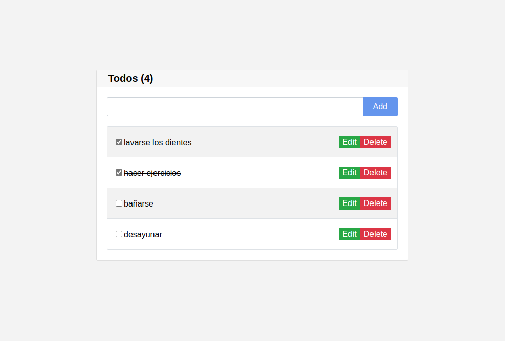

# Todo App

El App "Todo" es un aplicativo web muy simple de usar y util para poder organizar, recordar y realizar tus tareas mas importantes!

[link demo](https://joshuagvc.github.io/todo-app)

## ¿Como usar el app?

- Escribir el "Todo".
- Apretar el boton "Add" y se agregara tu tarea.
- En la parte superior encontrara un contador que indica el numero de "todo" que lleva registrando.
- Al culminar la tarea, podras apretar el checkbox y el texto se tachara indicando que fue realizado.
- Si por error agrega un "Todo" hay un boton que dice "delete", podras borrar el "Todo".
- Si desea editar habra un botón que dice editar, podra modificar el "todo".
- Lo mejor de todo, es que podrá apagar, reiniciar la pc o cerrar y actualizar la pagina y los "Todo" registrados seguirán tal cual lo dejo!.

## Datos de la creacion de la app.

Esta app fue ralizada con React, fue muy divertido desarrollar esta App, sobretodo al darle la funcionabilidad, ya que tenia que agregar una lista de cosas por hacer de una forma dinamica y lo que mas me gusto fue darle el funcionamiento de agregarlo al local storage y no perder los cambios realizados, espero que les haya gustado mi codigo y animo a que puedan realizar su propio "Todo App".

